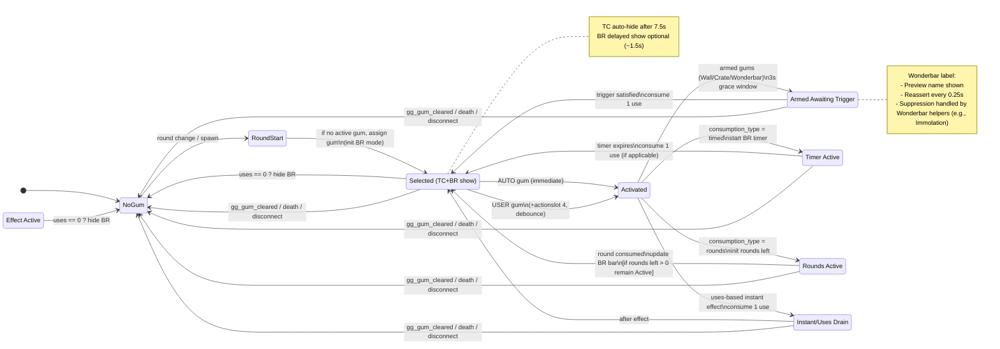

# BO1 GobbleGum MOD

---

## 1. Module Structure

* **`gumballs.gsc` (Core logic)**

  * Gum registry & activation dispatcher
  * Player lifecycle hooks (spawn, death, disconnect)
  * Selection & round watcher
  * Gum activation & consumption model
  * Effect implementations
  * Armed gums (Wall Power, Crate Power, Wonderbar) with weapon polling, Pack-a-Punch upgrades, Wonder Weapon replacement, and test Fire Sale hook
  * Reads dev DVARs (`gg_enable`, `gg_debug`, `gg_test_drop_firesale_on_arm`, `gg_wonder_include_specials`, etc.) at init to allow fast iteration
  * Provides registry helpers: `gg_register_gum`, `gg_find_gum_by_id`
  * Player state builder: `build_player_state`, `gg_set_selected_gum_name`, `gg_apply_selected_gum`
  * Included via `#include maps\gobblegum\gumballs;` in `_zombiemode.gsc`
  * Bootstrapped after helpers/HUD with `level thread maps\gobblegum\gumballs::init();`
* **`gb_hud.gsc` (HUD & UX)**

  * Precache shaders/fonts (`white`, `specialty_perk`, `specialty_ammo`)
  * Included via `#include maps\gobblegum\gb_hud;`; precache runs before any player HUD builds
  * Top-Center HUD (icon, name, uses, description)
* Bottom-Right HUD (icon, usage bar [bg+fg], hint text, Wonderbar label preview)
  * Positioning uses `setPoint` with safe-area anchors (TC: `CENTER`/`TOP`, BR: `RIGHT`/`BOTTOMRIGHT`)
  * Layout driven by small config: base top offset, icon size, and vertical gaps; BR offsets and bar size
  * Fade/animation polish deferred; Build 5 wires BR bar logic
  * HUD API now live for BR uses/rounds/timer/label; helpers remain idempotent
* **`gb_helpers.gsc` (Utilities)**

  * Map-specific helpers (death machine maps, cosmodrome VO trigger)
  * Included via `#include maps\gobblegum\gb_helpers;`; init before HUD/core so shared helpers are ready
  * Constant getters for enums and knobs (`ACT_AUTO`, `CONS_TIMED`, `GG_TC_AUTOHIDE_SECS`, etc.)
  * Pack-a-Punch helper mirrors `_zombiemode_perks.gsc`; Wonder Weapon pool + display-name helpers drive Wonderbar (respects `gg_wonder_include_specials`)
  * Power-up spawn helpers (stub)
  * Safe `set_if_changed` wrappers
  * Math, pluralization, clamp
  * Thread safety wrappers
  * Legacy no-op stubs (compatibility)

### `_zombiemode.gsc` entry points (boot order)

```c
#include maps\gobblegum\gumballs;   // Core
#include maps\gobblegum\gb_hud;     // HUD
#include maps\gobblegum\gb_helpers; // Helpers

// GobbleGum bootstrap (helpers -> HUD precache -> core on level thread)
maps\gobblegum\gb_helpers::helpers_init();
maps\gobblegum\gb_hud::gg_hud_precache();
level thread maps\gobblegum\gumballs::gumballs_init();
```

**Why this order**

* Helpers expose common functions early.
* HUD assets must be precached before any player HUD is built.
* Core threads last so they can call both helpers and HUD safely.

All wiring stays inside the existing `_zombiemode.gsc` lifecycle ? no changes to the base round or perk systems.

---

## 2. Data Model

### Gum Definition

* `id` ? internal identifier
* `name` ? display/loc string
* `shader` ? HUD icon material
* `description` ? display/loc string
* `activation_type` ? AUTO or USER
* `consumption_type` ? timed / rounds / uses
* `activate_func` ? string key ? dispatcher
* **Metadata**

  * `tags` ? categories (powerup, perk, economy, weapon)
  * `map_whitelist`/`blacklist` ? enforce availability (e.g., Fatal Contraption on Ascension/Coast/Moon only)
  * `exclusion_groups` ? gums that cannot overlap
  * `rarity_weight` ? pool weighting

### Player State

* Current gum snapshot
* Uses/rounds/duration remaining
* Armed gum flags (wall_power_active, crate_power_active, wonderbar_active)
* Wonderbar choice cache (`wonderbar_choice`), label text, suppression timers, monitor tokens
* HUD fade tokens, defer-hide timestamps
* Selection pools (full vs. remaining)
* Activation debounce
* Effect end timers (e.g., Stock Option, Shopping Free)
* `player.gg.selected_id` stores current gum id
* `player.gg.selection_active` tracks whether the round's selection slot is occupied (cleared on activation or round rollover)
* `player.gg.effect_active` / `player.gg.effect_id` track effects that persist after the slot is freed
* `player.gg.uses_remaining`, `player.gg.rounds_remaining`, `player.gg.timer_endtime` reserved for consumption models
* `player.gg.armed_flags` default false
* `player.gg.hud` assigned by `gb_hud::init_player`

---

## 3. HUD Specification & API

### Layout

#### Top Center (TC)

* Icon (56?56)
* Gum Name (scale 1.5)
* Uses/Activation line (scale 1.15)
* Description (scale 1.15)

Positioning

- Anchor: `setPoint("CENTER", "TOP", 0, y)`
- Derived offsets: `block_top = base_y + icon_h + icon_gap`, then stack
  - Name at `block_top`
  - Uses at `block_top + gap_name_to_uses`
  - Desc at `block_top + gap_name_to_uses + gap_uses_to_desc`

**Behavior**

* Fade in on selection
* Auto-hide after 7.5s
* Refresh on state change

---

#### Bottom Right (BR)

* Hint text (scale 1.15)
* Icon (48?48)
* Usage Bar (shader `"white"`, width 75, height 5)

  * Modes: uses / rounds / timer
* BR label (Wonderbar preview) driven by HUD helpers

Positioning

- Anchor: `setPoint("RIGHT", "BOTTOMRIGHT", x_off, y_off)` for icon, bars, hint
- Bar consists of two layers at the same point:
  - Background bar (light gray) full width
  - Foreground bar (yellow) full width initially; drains left?right in later steps
  - Title/label is disabled in Step 1 (hint text only)

**Behavior**

* Show on selection (no fades)
* Hint text initially blank until set by core
* Hide when consumed/cleared in later steps

---

* Supports **delayed show** (smooth UX after selection/activation)
* Hint text set/cleared dynamically
* Label can be **suppressed and reasserted** (e.g., during Fire Sale suppression loop)

---

### HUD API

* `hud.init_player(player)`
* `hud.show_tc(player, gum)` / `hud.hide_tc_after(player, secs, expected_name)`
* `hud.update_tc(player, gum)`
* `hud.show_br(player, gum)` / `hud.hide_br(player)`
* `hud.show_br_after_delay(player, secs, expected_name)` *(stubbed initially)*
* `hud.set_hint(player, text)` / `hud.clear_hint(player)`
* `hud.br_set_mode(player, mode)`
* `hud.br_set_total_uses(player, n)` / `hud.br_consume_use(player)`
* `hud.br_set_total_rounds(player, n)` / `hud.br_consume_round(player)`
* `hud.br_start_timer(player, secs)` / `hud.br_stop_timer(player)`

Usage from `gumballs.gsc`:

* On selection: call `hud.show_tc` and `hud.show_br` (optionally `hud.show_br_after_delay`) then schedule `hud.hide_tc_after(7.5s)`.
* On consume/end: call `hud.hide_br()` to clear the bottom-right panel.
* Timers, uses, and rounds update the progress bar through `hud.br_start_timer`, `hud.br_consume_use`, and related helpers.

---

### Visual Rules

* Fade: 0.25s (token-based, prevents overlaps)
* TC auto-hide: 7.5s
* BR auto-hide: when gum ends
* **Grace window**: short defer-hide for Wonderbar, etc.
* **Delayed show**: fade in BR after ~1.5s if needed
* Anchors respect safe area
* Accessibility: text is primary, colors secondary

---

## 4. Gum Selection Logic

* Build pool (`pool_full` ? `pool_remaining`)

* Watch `round_number` (0.25s cadence)

* On round start:

  * Close the previous selection slot if it is still occupied (unused gums are discarded; ongoing effects continue with `effect_active` while the slot is freed)
  * Apply ROUNDS tick (if a rounds-based gum is active): decrement 1, update BR, end at 0
  * Always assign a fresh gum for the new round once cleanup completes
  * Round 1 delay: 10s before first gum
  * Pick gum: skip invalid (e.g., Perkaholic with full perks) and map-gated entries (e.g., DoNW on `zombie_theater`/`theater`), reset cycle if empty
  * Apply gum: set player vars, init BR bar mode and totals
  * Show HUD: show TC + BR (no fades yet)
  * Auto-gums: may activate immediately and detach the selection slot; timed/armed gums free the slot while the effect continues
  * Remove gum from `pool_remaining` (no repeats until reset)
  * Schedule TC auto-hide (7.5s)

* Map-level watcher in `gumballs::init` polls `level.round_number` about every 0.25s and calls `selection.on_round_start(player)` for each alive player without altering round flow.

* Each player registers `notifyOnPlayerCommand("gg_activate", "+actionslot 4")` with ~200ms debounce before dispatching to the gum effect dispatcher.

### Manual Override

* `gg_set_selected_gum_name()` + `gg_apply_selected_gum()`
* Applies gum immediately, HUD updates
* Policy toggle: whether overrides affect pool uniqueness
* Dev override `gg_force_gum` bypasses map gating (logs under `gg_debug`)

### Special Case

* **Ascension/Perkaholic**: also trigger `perk_bought_func` VO hooks for free perks.

---

## 5. Activation & Consumption

### User Activation

* Input: `+actionslot 4`
* 200ms debounce
* If gum is user type and allowed by the model guard:

  * Timed: start timer, dispatch effect; end when timer expires
  * Rounds: dispatch effect; ROUNDS decrement on round start while active
  * Uses: dispatch effect; consume 1 use per activation

### Auto Activation

* Immediate on selection if AUTO and model allows (e.g., Timed not already running)
* Mirrors user path, but without input
* Armed gums (Wall/Crate/Wonderbar) consume only when triggered (weapon acquired)

### Dispatcher

* Function map: string ? int code (fast path)
* Fallback: string compare (exhaustive list)

---

## 6. Effect Catalog (with Notes)

### Power-Ups

* Cache Back (Max Ammo)
* Dead of Nuclear Winter (Nuke) — gated off Kino der Toten (`zombie_theater`, `theater`)
* Kill Joy (Insta Kill)
* Licensed Contractor (Carpenter)
* Immolation Liquidation (Fire Sale) - triggers Wonderbar label suppression for 35s via helper
* Who?s Keeping Score (Double Points)
* On the House (Free Perk)
* Fatal Contraption (Death Machine) ? only on maps that allow
* Extra Credit (Bonus Points)
* Reign Drops (spawns the full bundle—Double Points, Insta-Kill, optional Fire Sale, Nuke, Carpenter, Max Ammo, Free Perk, Bonus Points, and Death Machine when allowed—sequentially on a forward-offset circle; uses consume once the sequence finishes)

### Weapons / Perks

* Hidden Power (PaP current weapon)

* Wall Power (next wall buy only—never box—upgraded after a 3s grace window)

* Crate Power (next box gun upgraded, 3s grace)

* Wonderbar (next box gun is WW)
  * Removes the box result before granting the cached Wonder Weapon, restores start ammo, and auto-switches to the reward
  * Mystery Box spin temporarily displays the Wonder Weapon model for the armed player
  * Label shows WW name
  * Label reasserts visibility every 0.25s until gum ends
  * Optional Gersh/Quantum specials via `gg_wonder_include_specials` (default 0)
  * Suppression triggered by Wonderbar helper calls (e.g., Immolation)

* **Perkaholic**
  * Auto, single-use gum that grants every perk available on the current map to players missing them.
  * Uses the helper perk cache so map-specific machines are respected and skips consumption when nothing is left to grant.
  * Triggers the Ascension/Cosmodrome perk VO via `level.perk_bought_func` when available.
  * Grant cadence is configurable with `gg_perkaholic_grant_delay_ms` (default 250ms) to keep HUD updates readable.

### Economy / Round Control

* **Round Robbin**
  * Uses-based instant gum that wipes remaining zombies, optionally zeroes round counters, and lets the next round begin immediately.
  * Awards every player the configurable `gg_round_robbin_bonus` (default +1600) and consumes one BR use; `gg_round_robbin_force_transition` (default 1) ensures round trackers stay in sync on scripted maps.
* **Shopping Free**
  * Timed gum controlled by `gg_shopping_free_secs` (default 60s); it grants `gg_shopping_free_temp_points` (default 50000) in temporary credit and keeps the player's visible score from falling while credit remains.
  * Re-shows the BR HUD in timer mode, debounces purchases through a refund monitor, and removes any leftover credit automatically when the timer expires.
* Stock Option (ammo taken from stockpile for 60s)

  * Fire monitor + expiry monitor

#### Testing

* **Round Robbin**
  ```
  set gg_enable 1
  set gg_debug 1
  set gg_force_gum round_robbin
  bind 8 "+actionslot 4"
  ```
  Press the bound key to verify all remaining zombies die, every player receives the bonus, and the next round starts cleanly.
* **Shopping Free**
  ```
  set gg_enable 1
  set gg_debug 1
  set gg_force_gum shopping_free
  bind 8 "+actionslot 4"
  ```
  Activate and confirm the BR timer, free purchases while credit remains, and automatic cleanup when the timer ends.
* **Perkaholic**
  ```
  set gg_enable 1
  set gg_debug 1
  set gg_force_gum perkaholic
  bind 8 "+actionslot 4"
  ```
  Activate to grant every missing perk; on Cosmodrome maps the perk VO hook should fire before each grant.

### Future / Placeholders

* Near Death Experience (stub)
* Respin Cycle (stub)

---

## 7. Thread & Safety Model

* `gumballs::init` hooks the existing `_zombiemode.gsc` lifecycle: on "connected" it runs `gb_hud.init_player(player)` then `gumballs.build_player_state(player)` (seeds defaults and binds the +actionslot 4 listener); on "spawned_player" it rebuilds the per-life HUD and reattaches monitors.
* Player threads always `endon("disconnect")`, and effect/monitor threads also `endon("gg_gum_cleared")` to guarantee cleanup.
* Round watcher polls `level.round_number` every ~0.25s, only observing progression before calling `selection.on_round_start(player)` for each alive player; we do not modify round flow.
* `self notify("gg_gum_cleared")` on forced clear or end-of-life stops timers and labels; round change alone no longer force-clears in Build 5.
* Fade tokens prevent overlapping fades.
* Armed gums use **3s grace window** to avoid false triggers.
* Wonderbar ends via both `gg_wonderbar_end` notify and cleanup path.

---

## 8. API Surfaces

### Core ? HUD

* All HUD functions above (show/hide/update, bar, hint, delay, `br_set_label`, `br_clear_label`)

### Core ? Helpers

* `helpers.map_allows("death_machine")`
* `helpers.is_cosmodrome()` / `helpers.get_current_mapname()`
* `helpers.get_wonder_pool(map)` (respects `gg_wonder_include_specials`)
* `helpers.get_weapon_display_name(weapon)`
* `helpers.upgrade_weapon(player, base)`
* `helpers.drop_powerup(player, code, pos|dist)`
* `helpers.player_has_all_map_perks(player)`

### Legacy Stubs (no-op, for compatibility)

* `gg_on_gum_used`
* `gg_round_monitor`
* `gg_assign_gum_for_new_round`
* `gg_on_round_flow`
* `gg_on_match_end`

---

## 9. Configurable Knobs

* Round-1 delay (default 10s)
* TC auto-hide (default 7.5s)
* HUD fade duration (default 0.25s)
* Armed gum grace window (default 3s)
* Wonderbar label suppression (default 35s when triggered via `gg_wonderbar_suppress_label`)
* BR delayed show (default 1.5s)
* Selection cadence (round-based vs. alternative)
* Override policy for manual gums
* Dev toggles: `gg_enable`, `gg_debug_hud`, and `gg_force_gum "<name>"` read at init for fast iteration without touching live flow.
* Build 5 consumption DVARs (safe fallbacks):
  - `gg_default_uses` (int, default 3)
  - `gg_default_rounds` (int, default 3)
  - `gg_default_timer_secs` (float, default 60.0)
  - `gg_timer_tick_ms` (int, default 100)
  - `gg_consume_logs` (0/1, default 1)
* Build 6 power-up knobs:
  - `gg_drop_forward_units` (float, default 70.0) - base forward offset when spawning drops.
  - `gg_reigndrops_forward_units` (float, default 145.0) - forward offset to the Reign Drops circle center.
  - `gg_reigndrops_radius` (float, default 70.0) - radius used when distributing the Reign Drops bundle.
  - `gg_reigndrops_spacing_ms` (int, default 150) - wait between Reign Drops spawns.
  - `gg_reigndrops_include_firesale` (0/1, default 1) - include Fire Sale in the Reign Drops bundle.
  - `gg_powerup_hints` (0/1, default 1) - allow HUD hint text after spawning a drop.
  - `gg_log_dispatch` (0/1, default 1) - keeps the power-up gum logging consistent with Build 3.
* Build 7 armed-gum knobs:
  - `gg_armed_grace_secs` (float, default 3.0) - grace window before armed gums can trigger.
  - `gg_armed_poll_ms` (int, default 150) - polling cadence when watching weapon changes.
  - `gg_wonder_label_reassert_ms` (int, default 250) - Wonderbar BR label reassert cadence.
  - `gg_test_drop_firesale_on_arm` (0/1, default 1 while testing) - spawn a Fire Sale when an armed gum activates (Wall/Crate/Wonderbar); disable after validation.
  - `gg_wonder_include_specials` (0/1, default 0) - optionally include Gersh Device (`zombie_black_hole_bomb`) and Quantum Bomb (`zombie_quantum_bomb`) in the Wonderbar weapon pool.
* Build 8 economy knobs:
  - `gg_round_robbin_bonus` (int, default 1600) - bonus points granted to every player when Round Robbin fires.
  - `gg_round_robbin_force_transition` (0/1, default 1) - force `level.zombie_total` to zero so round counters advance immediately.
  - `gg_shopping_free_secs` (float, default 60.0) - Shopping Free timer duration (seconds).
  - `gg_shopping_free_temp_points` (int, default 50000) - temporary credit granted while Shopping Free is active.
  - `gg_perkaholic_grant_delay_ms` (int, default 250) - delay between individual perk grants for Perkaholic (milliseconds).

---

## 10. Build Order

1. Skeleton registry + HUD stubs
2. Round watcher + gum selection ? dummy HUD updates
3. Dispatcher + input + dummy effect stubs
4. Position Hud Elements
5. Consumption logic (uses/rounds/timer)
6. Implement core power-up gums (alias map, spawn helper, Reign Drops bundle)
7. Add armed gums (Wall, Crate, Wonderbar)
8. Add economy/round gums (Shopping Free, Round Robbin, Perkahlic)
9. Harden map/perk checks + Ascension VO hooks
10. Refine HUD polish (hint text, delayed show, suppression)
11. Add placeholders, rarity weights, and debug commands

---

## 11. Lifecycle State Diagram



---

### Dev Console Tips

- To force a specific gum, set the DVAR in console:
  - `set gg_force_gum <id>` (e.g., `set gg_force_gum shopping_free`)
- Aliases also accepted: `set gg_force <id>` or `set force_gum <id>`.
- Using `gg_force_gum <id>` without `set` is a console command and will error.

---
